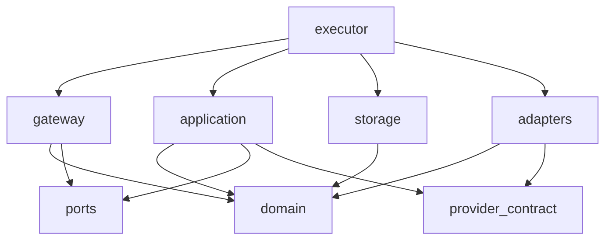

# Architecture enforcement

`fence.toml` defines the permitted import graph. Normal verification runs the pinned Fence implementation from the separate `tools/kennel.toml` project. It is a development dependency and is not included in either production OCI workload. Install it with `kennel install --project-dir tools`.

The intake gateway imports only domain logic and storage-port validation, plus Ability. It cannot import execution, persistence implementations or provider adapters. The client cannot import any other source zone. Application execution can use the provider contract, but adapters are constructed by the privileged composition root. Domain contracts have no provider dependency. New source files must be classified; a new provider directory requires an adapter-zone path, not a core semantic change.

`scripts/architecture_test.py` runs real Fence checks against source and fourteen forbidden-edge mutations in disposable source copies. It also requires exactly one zone per Kujo source file, resolvable internal modules, auditable single-line `from` imports, and only the explicitly permitted Ability external import in application, gateway, executor and identity modules. Five additional mutations verify public-export, unclassified-source and external-import rejection. The two root package shims are checked by the static import discipline against their exact permitted client target; Fence continues to scan `src`. The suite also checks Fence's scanned-file count against the actual source inventory so a misconfigured empty scan cannot pass. This supplements Fence's documented default allowance for external packages and its best-effort import detection. The TOML test bridge uses Kujo's own parser.

These are source-review and CI guardrails, not credential isolation. They do not stop arbitrary runtime builtins, malicious source rewriting, dynamic code, kernel compromise or a hostile operator. OCI separation and the deployment controls remain necessary. Future credential modules and execution primitives require explicit conformance tests as they are introduced; this milestone does not claim the complete all-sink security matrix has passed.
