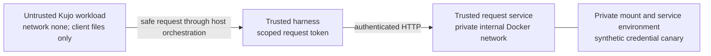

# Request service and tested credential boundary

## Local service

Install the pinned Ability dependency. Provision a **new** private directory:

```sh
export KUJO_BIN=/absolute/path/to/kujo
export PAYMENTS_PROVISION_DIR=/absolute/private/payments
export PAYMENTS_PRINCIPAL_JSON='{"type":"user","id":"your-user","tenant_id":"your-tenant"}'
bash scripts/provision.sh
export PAYMENTS_SERVICE_CONFIG="$PAYMENTS_PROVISION_DIR/service.json"
export KUJO_HTTP_SERVER_READ_TIMEOUT_MS=1000
"$KUJO_BIN" run src/executor/gateway.kujo --interpreter
```

Provisioning uses private directory/file permissions, generates a high-entropy scoped request token, stores only its constant-time HMAC verifier in service settings and refuses an existing directory. It prints neither the token nor provider credentials. The example currency table must be reviewed for the deployment. The token expires after 24 hours; restart with reviewed credential settings to rotate or disable it. Keep the token in trusted harness configuration, outside model context. This is a transport credential for requesting/inspecting intents; it grants no provider or execution operation.

The only HTTP route is `POST /v1/payments` with JSON and bearer authentication. Default credentials permit `request` and `inspect`; explicitly scoped programmatic credentials may also permit `inspect_revision` and `cancel` (see [conditional cancellation](cancellation.md)). Credential records bind a principal and allowed operations. Startup validates the [Payments/Ability identity profile](identity-compatibility.md) before opening the database; a structurally valid domain identity can still be unsupported by the installed Ability runtime. The server accepts no caller principal, financial approval or execute endpoint. Response/error projections are bounded. The client rejects redirects, uses DNS pinning and requires HTTPS except explicitly enabled loopback fixtures. Unknown transport outcomes must be inspected with the original request identity. [Interrupted invocation observations](interrupted-invocations.md) can recover a committed purchase summary on an exact retry without claiming operation success.

The service defaults to loopback. Do not expose its plain HTTP listener on a public network. Remote deployments need an authenticated TLS edge, request/header limits, rate limits and protected internal routing. Set an 8 KiB body limit at that edge; Kujo's native reader imposes an 8 MiB hard ceiling before the application's stricter 8 KiB JSON check. The native server is a bounded synchronous service, not a high-volume edge proxy. `--interpreter` is required for this HTTP route callback in the tested runtime. API tokens, headers and raw request bodies must not enter edge/application logs.

## OCI reference profile

`deployment/Dockerfile` pins the amd64 Ubuntu manifest and verifies the official Kujo 1.4.0 executable. `deployment/runtime.lock.json` pins archive and executable SHA-256 values. Downloads happen at image build time, never during a payment. Build and run the probe:

```sh
# A connected Docker engine and the pinned Ability package are prerequisites.
export PAYMENTS_CONTAINMENT_RECEIPT=/absolute/path/to/containment-receipt.json
bash scripts/deployment/test_oci.sh
```

The tested topology is:



The hostile workload and trusted service use separate filesystem, PID and network namespaces. Both are non-root, read-only, capability-dropped, no-new-privileges, with bounded processes/memory and private tmpfs. The workload receives no host home, vault, database, browser profile, Docker socket or payment environment. Its language-level private-network restriction is deliberately disabled in the probe so OS network isolation bears the test.

The test first proves the service can access its private canary. It then checks workload file/process-env/socket/command/symlink/network denial and verifies a distinct trusted harness can submit an intent. `/usr/bin/link` in Ubuntu is a coreutils hard-link utility, not Stripe's wallet CLI; the probe checks absence of the privileged provider executable/mounts rather than conflating those programs. Test fixture mounts use permissive fixture file modes to prove namespace separation; production vault ownership must additionally be restrictive.

This proves the recorded profile's synthetic checks, not resistance to kernel/hypervisor escape, host administrators, a compromised trusted service, or all providers. Docker Desktop's Linux VM is part of the trusted platform; this is not a microVM-per-payment claim. Production Link executor egress, key custody, real approval identity and all-sink leakage tests remain separate release gates. Workcell can supply the agent containment layer, but its profile must reproduce these controls; merely declaring secrets in Workcell would expose them to the workload.

## Financial execution

The network service accepts and tracks intent and provides explicitly scoped conditional cancellation. It exposes no payment execution or credential endpoint. The private operator issuer, bounded worker, Link adapter and credential/enrollment components are implemented and exercised with synthetic providers. A supported live installation connecting them to verified payment authority and authoritative merchant settlement is not yet demonstrated. Do not inject real payment credentials into this service merely because the synthetic containment probe passes.

| Installed component | Existing entrypoint | Installation responsibility still requiring acceptance |
| --- | --- | --- |
| Request service | `scripts/provision.sh`, `src/executor/gateway.kujo` | Authenticated caller/tenant provisioning, private storage and protected transport. |
| Human financial approval | `scripts/operator.sh` | Authenticate the operator through the OS/service boundary and privately review the exact snapshot. |
| Privileged lifecycle step | `src/application/worker.kujo` (`worker_step`) | Install trusted provider/confirmation callbacks, bound each process and schedule explicit steps outside the agent runtime. There is no generic live-worker launcher. |
| Link credential lifecycle | `src/providers/link/enrollment.kujo`, `credentials.kujo`, `revocation.kujo` | Supported client provisioning, verified funding-authority linkage, private delivery and guarded credential publication. |
| Financial confirmation | Installed `confirmation.verify(snapshot, observation)` | Correlate authenticated merchant/provider evidence with the exact account, payee, route and charge; token issuance or HTTP success is insufficient. |
| Incident handling | `scripts/control.sh`, conditional cancellation and reconciliation | Pause new claims; explicitly close unclaimed work or observe claimed work. Retain all private journals; recovery copies cannot resume spending. |

This is an entrypoint map, not a complete deployment recipe. The provider client, merchant confirmation source and hosting environment must be selected before their acceptance tests can be implemented and run. Those inputs belong to trusted installation, never model arguments. See [authority binding](provider-authority.md), [trusted ports](ports.md), [interrupted execution](interrupted-execution.md) and the current [release checklist](release-checklist.md).

The OCI test runner requires Docker Buildx and explicitly loads built images into the local engine before verification. A successful build-cache export alone is insufficient evidence that the tested local image contains current source.

## Clean Linux verification

The initial [CI run at 8d44c4d](https://github.com/kujolang/payments/actions/runs/34727010312) passed both the synthetic host suite and its current-image OCI checks. `docs/evidence/linux-ci.json` records that historical source/runtime scope. Later source-scoped verification is recorded in [implementation status](implementation-status.md) and `docs/evidence`; a historical green run does not verify a later checkout. None of these runs expands the containment threat model to an untested live installation. The hosted runner image is recorded by GitHub but is not itself a hermetically pinned build environment. The application runtime and container base are pinned.

For a clean Linux checkout, run `python3 scripts/deployment/fetch_runtime.py`, export `KUJO_BIN` to the resulting absolute `deployment/.runtime/kujo` path, then run `python3 scripts/ci/bootstrap.py` and `bash scripts/test.sh`. Docker Buildx is additionally required for `bash scripts/deployment/test_oci.sh`. Bootstrap downloads pinned public development sources; it does not obtain payment credentials or perform a financial operation.
