# Private Link device enrollment

`src/providers/link/enrollment.kujo` implements provider-private enrollment with an explicit SQLite journal. It acquires and privately hands off OAuth credentials; it is not payment authorization, a provider-account attestation, an agent login tool or a workflow scheduler. Core payment contracts, Ability definitions and the five-method payment SPI are unchanged.

The host supplies a private database and a closed configuration containing `credential_id`, `binding`, `label` and `origins`. `binding` reuses the credential vault's exact tenant/payer/account/client/scope contract. The client must be registered for the installation; no CLI client identifier or hostname is copied. HTTPS operator origins must be explicitly installed. Label and origin changes conflict with an existing enrollment. Both enrollment ID and target credential ID are permanent journal identities; another enrollment ID cannot initiate a second session for the same target in this journal.

## Bounded operations

- `open_link_enrollment(db)` initializes or validates the exact separate private v1 schema. It cannot open the core journal, credential vault or approval outbox as an enrollment store.
- `start_link_enrollment(db, id, config, device, clock_ms, deadline_ms)` reserves before initiating one device session. Repeated calls inspect the original state; they never recreate a lost initiation.
- `inspect_link_enrollment(db, id, config)` returns only ID, state, revision, expiry and next-poll time. `ok: true` means metadata is available, not that a connection or payment is authorized.
- `deliver_link_enrollment(db, id, config, deliver, clock_ms, deadline_ms)` passes the reviewed expected binding, label, URLs and user confirmation code only to an installed private operator sink. The device code and tokens are absent. It checks state, binding and expiry before and after delivery. The sink must authenticate the operator, escape untrusted text and enforce process/browser/logging isolation; delivery cannot retract content already shown.
- `poll_link_enrollment(db, id, config, device, clock_ms, deadline_ms)` performs at most one due token request. It persists the next due time after explicit pending/slow-down responses. There is no polling loop, sleep or automatic workflow inside the module.
- `accept_link_enrollment(db, id, config, accept_tokens, clock_ms, deadline_ms)` reserves a single private acceptance attempt. The callback receives the target ID, expected binding, filtered tokens, conservative token-request start time and deadline. It must verify the actual provider-account/grant binding before installing credentials. The synthetic callback uses the existing credential vault; it does not establish a real Link identity verifier.
- `link_enrollment_api(db, id, config, api)` guards the matching private credential API with the immutable enrollment binding and accepted state on every call. Install this guarded callback in the Link provider route. A missing, interrupted, failed or abandoned enrollment denies before the underlying API is called.
- `abandon_link_enrollment(db, id, config, revision)` revision-checks local abandonment and clears active secret columns. It does not revoke an already-issued remote grant, retract an operator URL or cancel an in-flight callback.

Only trusted host code can construct these callbacks and configuration. The public gateway and default two-tool SDK/MCP projections expose none of these operations.

## Lifecycle and persistence

```mermaid
stateDiagram-v2
    [*] --> initiating: reserve unique enrollment and credential target
    initiating --> pending: validated device response
    pending --> polling: due time and CAS winner
    polling --> pending: explicit pending or slow_down
    polling --> received: validated scoped tokens
    received --> accepting: reserve private handoff; clear staged tokens
    accepting --> accepted: callback succeeds; receipt commits
    initiating --> unknown: failed or malformed response
    polling --> unknown: ambiguous or invalid token exchange
    accepting --> unknown: rejected or uncertain handoff
    polling --> rejected: explicit provider denial
    polling --> expired: explicit provider expiry
    pending --> expired: local expiry observed by poll
    received --> expired: local expiry observed by acceptance
```

Revision-checked abandonment can terminate any nonterminal state. Terminal states never re-enter issuance or acceptance. Schema checks constrain the secret columns by state and make identity/deletion immutable. Single-statement CAS updates protect concurrent callers; the journal uses the existing exact-schema initializer with SQLite FULL synchronous mode and bounded busy timeout.

A process crash can leave `initiating`, `polling` or `accepting`. Inspection does not claim the process is dead. Calls observe these reservations without re-entry. An operator may abandon local state and review provider-side account/session state before a deliberate new enrollment with new identities. Unexpected errors and connection loss stop the current enrollment; no token request is blindly retried.

Pending and slow-down semantics follow [RFC 8628 section 3.5](https://www.rfc-editor.org/rfc/rfc8628.html#section-3.5): the default interval is five seconds when absent, and slow-down adds five seconds for subsequent requests. Due times are conservatively measured after the previous response. This implementation stops on ambiguous exchanges instead of automatically retrying after network loss; it does not claim complete OAuth deployment conformance. The Link-specific `authorization_failed` error is normalized as rejection using the pinned provider source.

Device response lifetime is measured from initiation start; token lifetime is measured from the token-request start, never response completion. Invalid scope, nonempty unreviewed authorization details, late response or clock rollback fail closed. Device expiry, interval, field length and ASCII form restrictions are private parser bounds, not universal payment capabilities. Normal inspection is read-only; a due poll/acceptance or explicit abandonment performs logical cleanup. A stalled reservation requires operator cleanup.

## The cross-store boundary

Enrollment acceptance and credential installation are separate private stores. They are **not an atomic transaction**. A crash after the callback installed credentials but before the enrollment receipt commits leaves `accepting` with no staged token and may leave an active credential-vault row. It must not invoke the callback or token endpoint again automatically. The supplied `link_enrollment_api` guard mechanically denies the underlying API in this window. Construct it around the matching `link_credential_api(vault, credential_id, binding, clock_ms)` before installing the route; do not publish the unguarded callback. The host must inspect and reconcile the uncertain installation, or disable/revoke that vault generation before a deliberate new enrollment with new identities. It must never patch a failed enrollment into accepted state or repeat the installer automatically. The guard does not provide cross-store atomicity, operator incident recovery, backup freshness or protection against a privileged host that deliberately selects an unguarded API.

A callback returning true is a trusted-host assertion, not independent proof of the provider account. The reviewed Link token/user-info material has not established the required authority linkage. A global provider subject is one possible evidence source, not a universal prerequisite; see [provider authority binding](provider-authority.md). Enrollment success must not be substituted for verified account identity or for a separate financial approval.

## Secret boundary and transport

The enrollment database is vault-classified, including SQLite pages, journals and backups. Live columns may contain device codes, operator URLs/user codes or filtered access/refresh tokens. Phase changes remove no-longer-needed live columns; acceptance clears staged tokens before the callback. This is logical deletion, not secure erasure, memory zeroization or safe backup restoration. No native error, response, code, token or URL is returned in status, Ability receipts or generic workflow state.

`link_oauth_device(clock_ms)` uses only fixed `https://login.link.com/device/code` and `/device/token` endpoints, reviewed form fields, a five-second native timeout, 32 KiB response limit, no redirects, DNS pinning and private-destination denial. Arbitrary endpoints, verbose native logging and shell execution are absent. Injected callbacks remain trusted code: post-call deadlines cannot preempt them, so the host must enforce process/runtime bounds. The operator sink and acceptance callback belong outside the requesting agent's OS/runtime boundary.

Provider fields and error behavior are grounded in [the pinned Link auth resource](https://github.com/stripe/link-cli/blob/4aa62ba34eaeb884d00041681f5c7801521c0bf8/packages/cli/src/auth/auth-resource.ts) and its types, verified against `deployment/link-source.lock.json` on 2026-09-13. No client registration, live token exchange, account action or payment was performed by normal tests.

## Verification and remaining acceptance

`tests/network/link_enrollment_test.py` runs real private Kujo processes with a non-deduplicating synthetic provider ledger and separate credential vault. It checks timed pending/slow-down, unique credential targets, private delivery and expected terms, filtered credential acceptance, four-way start/poll/accept races, wrong bindings/origins, native/renderer/installer and persistence faults, late responses/clock rollback, grant mismatch, abandonment races, expiry and four SIGKILL boundaries including after vault installation. All process output is scanned for sentinel secrets. Generic payment/Ability journals and agent tools are uninvolved.

Supported client registration, stable provider-account verification, authenticated operator/installer deployment, crash recovery across stores, dedicated enrollment containment/all-sink tests and provider sandbox/live acceptance remain open. Existing synthetic OCI evidence must not be relabeled as proof of those deployment-specific properties.

The dedicated containment fixture seeds both pending device codes and staged received tokens in the privileged journal, plus the private operator payload, before the hostile OCI/Workcell workloads run. Those workloads attempt the journal, SQLite sidecars, renderer output and provider-module paths. See implementation-status.md for source-scoped verification status; a local seed pass establishes positive controls, not physical isolation.
